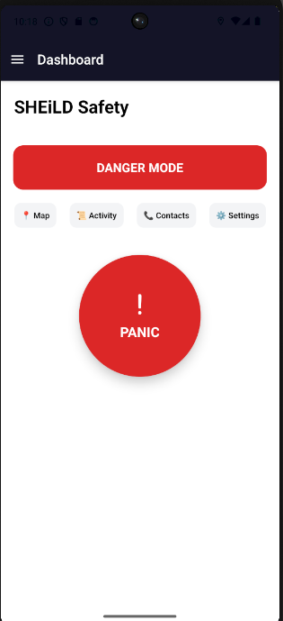
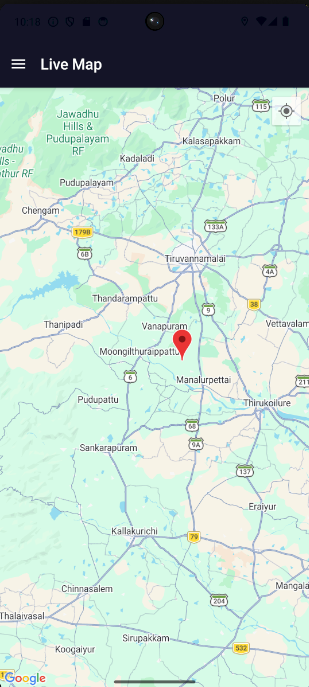
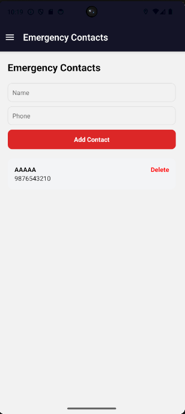

# 🔷 SHEiLD – Smart Women Safety System

## 🚨 Overview

SHEiLD is an intelligent women safety mobile application designed to provide real-time protection using emergency alerts, live location tracking, and threat detection.

---

## 💡 Problem Statement

Women safety remains a major concern. Existing apps are:

- Slow to access during emergencies  
- Limited to basic SOS features  
- Lack real-time threat awareness  

---

## 🚀 Our Solution

SHEiLD provides:

- 🔴 One-tap PANIC system  
- 📍 Real-time location sharing  
- 🗺️ Smart safety map (heat zones)  
- 📩 Instant SMS alerts  
- 📊 Threat-level detection system  
- 👥 Emergency contact integration  

---

## 🧠 Key Innovation

Unlike traditional apps, SHEiLD:

- Uses dynamic threat states (SAFE → THREAT → EMERGENCY)  
- Integrates map-based safety visualization  
- Provides quick-access UI (no delay in panic)  

---

## 🛠️ Tech Stack

- React Native (Expo)  
- Firebase Authentication  
- MapLibre + OpenStreetMap  
- SMS integration  
- Location Services  

---

## 📱 Features

- Panic Button 🚨  
- Live Location Tracking 📍  
- Emergency SMS Alerts 📩  
- Activity Monitoring 📜  
- Contact Management 👥  
- Safety Heatmap 🗺️  

---

## 📸 Screenshots

### 🏠 Home Screen

### 🗺️ Map View

### 👥 Contacts

---

## 🎯 Future Scope

- AI-based threat prediction  
- Community-driven danger zones  
- Voice-trigger emergency system  

---

## 👨‍💻 Developer

Saravana Kumar